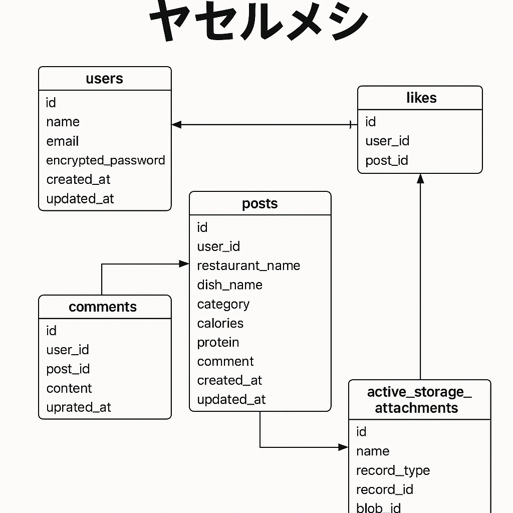

# README

# 🥗 ヤセルメシ（Yaseru Meshi）

「痩せたいけど外食したい！」  
そんなニーズに応える、低カロリー・高たんぱくな飲食店メニューを投稿・共有できるWebアプリです。

---

## 📍 本番環境
👉 [ヤセルメシ本番環境](https://yaseru-meshi-app-dc635d2c5157.herokuapp.com/)

## 💻 GitHubリポジトリ
👉 [GitHub: yaseru_meshi](https://github.com/itoukaiho/yaseru_meshi.git)

---

## 🌟 アプリ概要

### ■ 背景・目的
健康志向が高まる現代、外食においても「低カロリー・高たんぱく」な選択を求める人が増えています。  
**ヤセルメシ**は、そんなユーザーが外食でもダイエットを継続できるよう、健康的な食事情報を投稿・検索・共有できるSNS型アプリです。

---

## 🔧 主な機能（要件定義）

### 🔐 認証・認可（Devise）
- ユーザー登録 / ログイン
- ゲストログイン（ワンクリックで体験）
- プロフィール編集・退会
- 投稿の編集・削除は投稿者のみ可能
- ゲストユーザーは編集/削除不可（制限付き）

### 📝 投稿機能
- 「ヤセルメシ」投稿（店舗名、料理名、カテゴリ、栄養情報、写真、コメント）
- 投稿一覧 / 詳細表示
- 投稿の編集 / 削除（投稿者のみ）
- 投稿への「いいね」機能

### 🌐 地図連携機能
- 現在地を中心に、投稿されたお店をGoogle Map上にマーカー表示
- マーカークリックで投稿詳細に遷移
- Google Maps JavaScript API 使用

### 📊 栄養情報の自動取得
- FatSecret APIを用いて、料理名からカロリーやたんぱく質等を取得（英語表記）
- APIで取得できない場合はChatGPTなどによる補完も検討

---

## 📷 画面イメージ
- トップページ
- 地図表示
- 投稿詳細
- 新規投稿
- 人気TOP10ページ
- お気に入りページ
- マイページ
※本番環境にてご確認いただけます。

---

## 🗺 ER図


---

## 💻 技術スタック

| 項目           | 使用技術                         |
|----------------|----------------------------------|
| フレームワーク | Ruby on Rails 7                  |
| データベース   | PostgreSQL                        |
| 認証機能       | Devise                            |
| 外部API        | FatSecret API、Google Maps API    |
| 地図表示       | JavaScript + Google Maps         |
| UI             | Bootstrap（一部カスタムCSS）     |
| 開発環境       | Docker（ローカル）               |
| 本番環境       | Heroku                           |

---

## 🧪 テスト・品質
- RSpecによるモデル／コントローラの単体テスト（一部実装済）
- セキュリティ：Devise認証、編集制限、CSRF対策など
- パフォーマンス：投稿一覧／MAPは3秒以内で表示完了を目標

---

## 🚀 今後の拡張予定
- 管理者機能（不適切投稿の削除／ユーザー管理）
- 栄養情報の日本語対応
- OPEN AI API追加予定（投稿時、AIがより低カロリーになる案をいくつか教えてくれるような機能）
- 検索フィルター機能（カテゴリ、栄養条件など）

---

## 🧑‍💻 ユーザー種別と権限

| 種別             | 権限内容                                                         |
|------------------|------------------------------------------------------------------|
| ゲストユーザー   | 投稿閲覧・いいねのみ可、投稿/編集/削除は不可                    |
| 一般ユーザー     | 投稿・編集・削除可能、自身の投稿を管理可能                      |
| 管理者（予定）   | ユーザー管理、不適切投稿削除など（将来的にActiveAdmin等で実装予定） |

---

## 🗃 ディレクトリ構成（一部）

```bash
app/
├── controllers/
├── models/
├── views/
├── javascript/
├── assets/
└── services/       # FatSecretAPI連携ロジック
🛠 セットアップ手順（Docker環境）

git clone https://github.com/itoukaiho/yaseru_meshi.git
cd yaseru_meshi
cp .env.sample .env   # APIキー等を設定
docker-compose up --build
# アクセス: http://localhost:3000


📩 制作者について
エンジニア転職を目指して開発したポートフォリオアプリです。
「食」✕「健康」✕「Web技術」に向き合い、Railsと外部APIを組み合わせて実践的な開発を意識しました。

📬 お問い合わせ
ご興味をお持ちいただけた方は、GitHub経由またはポートフォリオサイトよりお気軽にご連絡ください！
